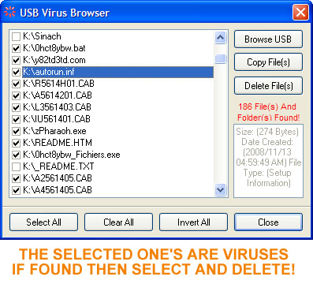



## View  All Hiden Files In USBs or Other Drives\.

### Description

View Hidden Files In Your USB (Memory Sticks).

All Invisible Threats are Now Visible!
 
### More Info
 
'ENJOY WATCHING ALL FILES AND FOLDERS AND ALL HIDDEN FILES OR THREATS IN USBS AND REMOVING THEM BEFORE INFECTING YOUR PC

'STEPS TO FOLLOW:

'1. RUN THE PROGRAM

'2. INSERT YOUR USB

'3. CLICK ON THE BROWSE BUTTON

'4. CLICK ON THE VIEW FILES AND FOLDERS

'5. THE PROGRAM WILL DISPLAY ALL FILES VISIBLE AND THE ONCE HIDDEN

'6. BECAREFULL OF THE FOLLOWING KIND OF FILES

'6.1 AUTORUN.INF  IT CARRIES VIRUS INFORMATION(WHEN DOUBLE CLICKING YOUR USB THIS GETS ACTIVATED AND RUN THE .EXE ; .CMD OR .BAT FILES TO INFECT YOUR PCs

'6.2 .CMD; .EXE ; .BAT FILES WHICH YOU NEVER ADDED TO YOUR USB AND ARE NOT VISIBLE WHEN YOU OPEN YOUR USB BUT ONLY VISIBLE WITHIN THIS PROGRAM

'7. DELETE ALL FILES STATED IN 6.1 AND 6.2 AS THEY ARE VIRUSES OR THREATS

'8. BECAREFULL IF YOU HAVE CHANGED THE mDrive.DriveType = Removable AS THIS WILL ENABLE YOU TO VIEW SYSTEM HIDDEN FILES IN OTHER DRIVES AND DELETING THEM CAN RESULT IN SYSTEM FAILURE

'9. VOTE FOR ME(MY E-MAIL IS: manoflo@webmail.co.za)

'10. ENJOY WATCHING VIRUSES DYING UNDER YOUR CLICKS OF THE MOUSE!

'KIND REGARDS

'MAMUSHIANA

1.I Assume this program will set a good foundation for working with files and folders

2.You will be able to create your own anti virus or remove them from your USB manually!.

All USB(Memory Stick Hidden Files e.g. Threats that in invisible)

Deleting The AUTORUN.INF may results in the USB ICON replaced by the like a folder.

             |
---                |---
**Submitted On**   |2008-11-20 17:44:12
**By**             |[Manoflo](https://github.com/Planet-Source-Code/PSCIndex/blob/master/ByAuthor/manoflo.md)
**Level**          |Advanced
**User Rating**    |5.0 (10 globes from 2 users)
**Compatibility**  |VB 5\.0, VB 6\.0
**Category**       |[Coding Standards](https://github.com/Planet-Source-Code/PSCIndex/blob/master/ByCategory/coding-standards__1-43.md)
**World**          |[Visual Basic](https://github.com/Planet-Source-Code/PSCIndex/blob/master/ByWorld/visual-basic.md)
**Archive File**   |[View\_\_All\_21348211212008\.zip](https://github.com/Planet-Source-Code/manoflo-view-all-hiden-files-in-usbs-or-other-drives__1-71428/archive/master.zip)

